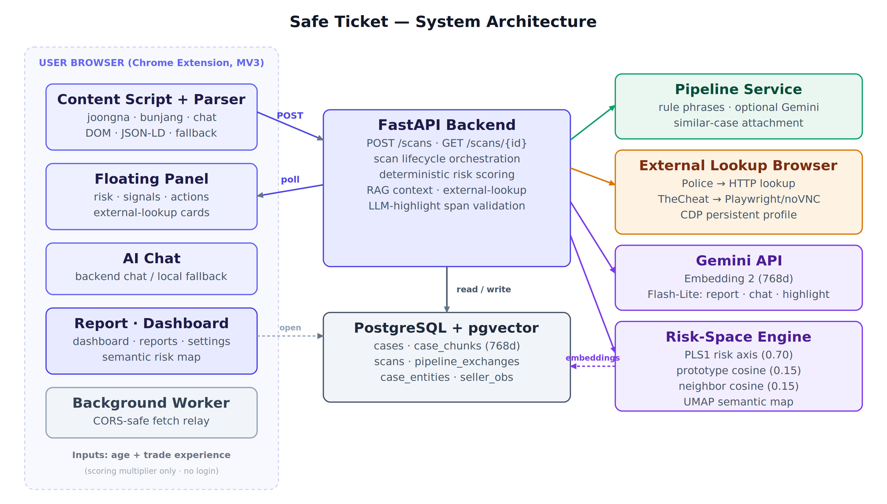
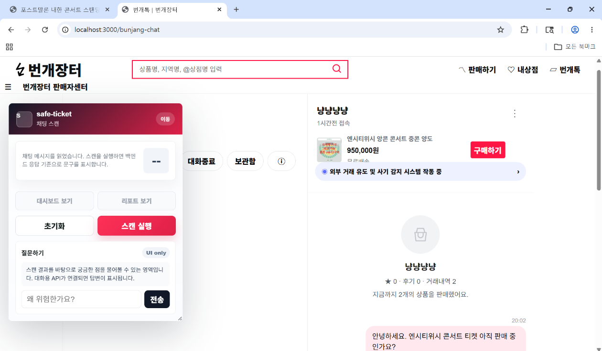
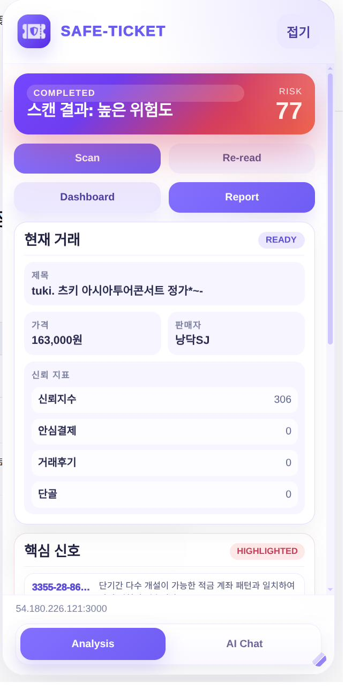
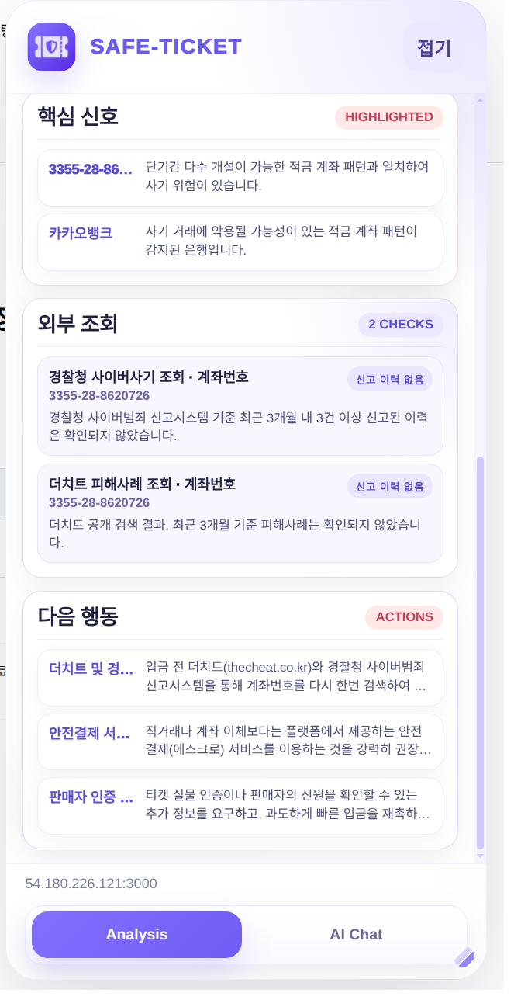
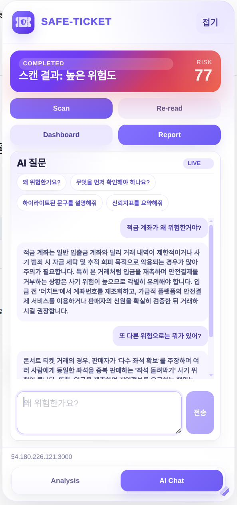
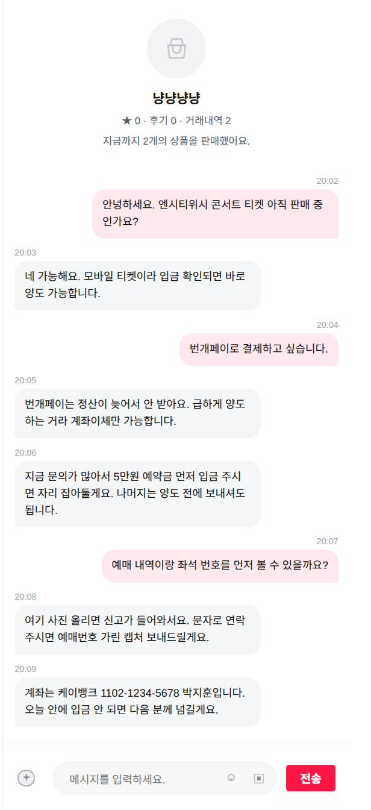
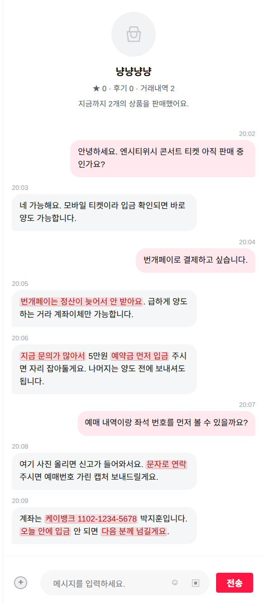
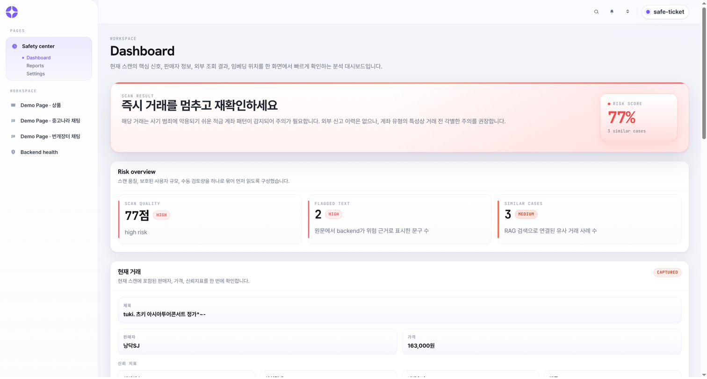
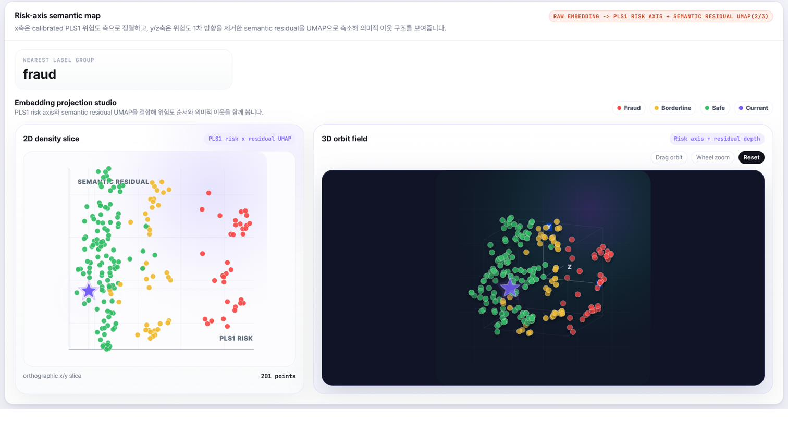
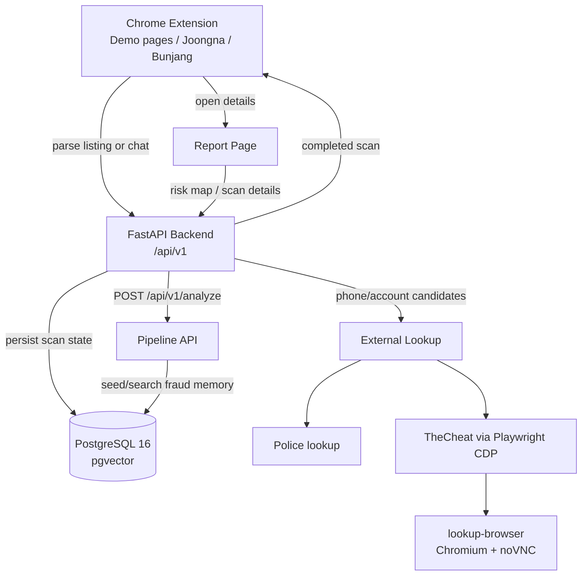

# Safe Ticket

Safe Ticket은 중고거래와 티켓 양도 글에서 사기 위험 신호를 탐지하고, Chrome Extension 패널과 Report Page로 설명 가능한 분석 결과를 보여주는 캡스톤 프로젝트입니다.

최종 MVP는 거래 페이지/채팅 화면을 파싱하는 Chrome Extension, scan lifecycle을 관리하는 FastAPI backend, PostgreSQL + pgvector 저장소, RAG/LLM 보조 분석을 위한 pipeline API, TheCheat 조회용 noVNC browser 컨테이너, React report dashboard로 구성됩니다.

## Evaluation Quick Start

평가자가 바로 데모를 확인하려면 이미 배포된 Lightsail 서버를 backend/report 서버로 사용하고, Chrome에는 extension `dist`를 unpacked extension으로 올리면 됩니다.

### 1. Build Or Use Extension Dist

`apps/frontend/extension/dist` 폴더가 이미 있으면 이 단계는 건너뜁니다. `dist`가 없거나 서버 IP를 다시 반영해야 하면 아래처럼 build합니다.

```bash
corepack enable
pnpm install --frozen-lockfile

SERVER_HOST=54.180.226.121
VITE_SAFE_TICKET_API_BASE_URL=http://${SERVER_HOST}:8000 \
VITE_SAFE_TICKET_FRONTEND_BASE_URL=http://${SERVER_HOST}:3000 \
pnpm --dir apps/frontend/extension build
```

빌드 산출물:

```text
apps/frontend/extension/dist
```

### 2. Load Dist In Chrome

1. Chrome에서 `chrome://extensions`를 엽니다.
2. 오른쪽 위 `Developer mode`를 켭니다.
3. `Load unpacked`를 누릅니다.
4. `apps/frontend/extension/dist` 폴더를 선택합니다.
5. 아래 데모 페이지 중 하나를 열고 Safe Ticket floating panel이 뜨는지 확인합니다.

### 3. Open Demo Pages

| Demo | URL |
| --- | --- |
| Product detail demo | `http://54.180.226.121:3000/product/227242032.html` |
| Joongna chat demo | `http://54.180.226.121:3000/joongna-chat.html` |
| Bunjang chat demo | `http://54.180.226.121:3000/bunjang-chat.html` |
| Report page | `http://54.180.226.121:3000/report/` |
| Backend Swagger UI | `http://54.180.226.121:8000/docs` |

extension panel이 보이지 않으면 `chrome://extensions`에서 Safe Ticket extension의 `Reload`를 누른 뒤 데모 페이지를 새로고침합니다.

로컬에서 전체 stack을 직접 띄워 검증하려면 아래 `Local Docker Quick Start`를 사용합니다.

## Screenshots

아래 이미지는 시스템 구조와 주요 화면입니다.

<p align="center">
  
</p>

| Ready | Completed | Evidence / actions | AI chat |
| --- | --- | --- | --- |
|  |  |  |  |

| Chat before scan | Chat after highlighting | Report dashboard | Risk map |
| --- | --- | --- | --- |
|  |  |  |  |

## What It Does

- 거래 페이지 또는 채팅 DOM에서 제목, 가격, 판매자, 본문, 계좌/전화번호 후보를 추출합니다.
- `POST /api/v1/scans`로 scan job을 만들고, frontend가 `GET /api/v1/scans/{scan_id}`를 polling합니다.
- backend는 pipeline 분석, 외부 신고 조회, RAG 유사 사례 검색, PLS risk-space scoring, 사용자 맥락 보정, 선택적 Gemini 설명 생성을 조합합니다.
- risk score는 LLM 출력이 아니라 결정론적 scoring code로 계산합니다. LLM은 summary, reasoning, recommended actions, highlight 후보 생성에만 사용합니다.
- 결과는 위험도, 점수, 근거 문구, 외부조회 카드, 유사 사례, 권장 행동, report URL로 반환됩니다.
- Extension은 현재 페이지에 floating panel을 띄우고 위험 문구를 highlight합니다.
- Report Page는 scan 결과를 dashboard/report/settings 화면으로 보여줍니다.
- 로그인은 의도적으로 제외했고, 사용자가 입력하는 값은 나이와 중고거래 경험 수준뿐입니다. 이 값은 최종 risk score의 보수적 multiplier로만 반영됩니다.

## Architecture



### Main Components

| Path | Role |
| --- | --- |
| `apps/frontend/extension` | Manifest V3 Chrome Extension. Floating panel, scan 실행, polling, highlight, chatbot helper, report link. |
| `apps/frontend/report-page` | Vite/React report dashboard. Scan detail, risk map, seller context, settings view. |
| `apps/frontend/shared` | Marketplace parser, API clients, runtime URL resolver, shared types. |
| `apps/backend` | FastAPI backend. Scan lifecycle, DB persistence, external lookup, RAG scoring, LLM fallback, seller report. |
| `apps/pipeline` | Pipeline API and batch scripts. Crawling, cleaning, entity extraction, memory export, embeddings, retrieval. |
| `docker` | Dockerfiles and lookup-browser runtime files. |
| `docs` | Architecture, API, Docker, frontend, pipeline, local/server deployment notes. |

## Local Docker Quick Start

로컬 서버는 내 PC에서 Docker Compose로 전체 서비스를 띄우는 방식입니다. 이때 browser에서 보는 `localhost`는 AWS가 아니라 내 PC입니다.

### Prerequisites

- Docker Desktop 또는 Docker Engine + Compose
- Node.js 20 계열
- `pnpm` 10.28.2 (`corepack enable` 사용 권장)
- Chrome 또는 Chromium

### 1. Prepare Environment

```bash
cp .env.example .env
```

기본 로컬 값:

```env
BACKEND_PORT=8000
FRONTEND_PORT=3000
PIPELINE_PORT=8010
DB_PORT=5432
LOOKUP_BROWSER_PORT=6080
VITE_SAFE_TICKET_API_BASE_URL=http://localhost:8000
VITE_SAFE_TICKET_FRONTEND_BASE_URL=http://localhost:3000
FRONTEND_REPORT_BASE_URL=http://localhost:3000/report/#/reports
```

이미 로컬 PostgreSQL이 `5432`를 쓰고 있으면 `DB_PORT=5433`으로 실행합니다.

### 2. Start Services

```bash
docker compose up --build
```

DB 포트 충돌 시:

```bash
DB_PORT=5433 docker compose up --build
```

서비스 URL:

| Service | URL |
| --- | --- |
| Product demo | `http://localhost:3000/product/227242032.html` |
| Joongna chat demo | `http://localhost:3000/joongna-chat.html` |
| Bunjang chat demo | `http://localhost:3000/bunjang-chat.html` |
| Report page | `http://localhost:3000/report/` |
| Backend health | `http://localhost:8000/api/v1/health/live` |
| Backend docs | `http://localhost:8000/docs` |
| Pipeline health | `http://localhost:8010/health` |
| TheCheat noVNC browser | `http://localhost:6080/vnc.html` |

### 3. TheCheat Login Browser

TheCheat은 OTP 로그인이 필요해서 완전 자동 로그인을 하지 않습니다. Docker 안의 Chromium browser profile을 로그인 상태로 유지하고 backend가 CDP로 재사용합니다.

1. `http://localhost:6080/vnc.html`을 엽니다.
2. noVNC에서 `Connect`를 누릅니다.
3. 열린 Chromium에서 TheCheat 로그인과 OTP 인증을 완료합니다.
4. 이후 backend의 external lookup이 같은 browser session을 재사용합니다.

주의: `docker compose down -v`는 DB volume과 lookup browser profile volume을 삭제합니다. 발표/검증 중에는 `-v`를 붙이지 않는 편이 안전합니다.

서버 배포에서는 noVNC `6080` 포트를 전체 공개하지 않습니다. 기술보고서 기준 Lightsail firewall에서는 frontend/report `3000`, backend API `8000`만 공개하고, noVNC `6080`은 개발자 IP로 제한했습니다.

## Chrome Extension Build And Load

Extension dist는 Docker Compose가 자동으로 Chrome에 올려주지 않습니다. 별도 build 후 Chrome에서 unpacked extension으로 로드합니다.

### 1. Install Frontend Dependencies

```bash
corepack enable
pnpm install --frozen-lockfile
```

### 2. Build Local Extension

```bash
VITE_SAFE_TICKET_API_BASE_URL=http://localhost:8000 \
VITE_SAFE_TICKET_FRONTEND_BASE_URL=http://localhost:3000 \
pnpm --dir apps/frontend/extension build
```

빌드 산출물:

```text
apps/frontend/extension/dist
```

### 3. Load In Chrome

1. Chrome에서 `chrome://extensions`를 엽니다.
2. 오른쪽 위 `Developer mode`를 켭니다.
3. `Load unpacked`를 누릅니다.
4. `apps/frontend/extension/dist` 폴더를 선택합니다.
5. demo page를 열고 Safe Ticket floating panel이 뜨는지 확인합니다.

코드를 수정한 뒤에는 다시 build하고 `chrome://extensions`에서 해당 extension의 `Reload`를 누릅니다. 삭제 후 재설치할 필요는 없습니다.

### 4. CORS Check

Extension ID는 `apps/frontend/extension/public/manifest.json`의 `key`로 고정되어 현재 기본값이 `piplejjlfnkhpaaepdmmpbljnmcnjaga`입니다. Chrome에서 다른 ID가 보이면 `.env`의 `BACKEND_CORS_ORIGINS`에 추가합니다.

```env
BACKEND_CORS_ORIGINS=http://localhost:3000,http://127.0.0.1:3000,chrome-extension://piplejjlfnkhpaaepdmmpbljnmcnjaga
```

`.env` 변경 후 backend 컨테이너를 재생성합니다.

```bash
docker compose up -d --force-recreate --no-deps backend
```

## Local Vs Server IP

서버에서 build한 frontend/extension을 사용자 PC의 Chrome에서 열 때 `localhost`를 쓰면 안 됩니다. 사용자 browser 입장에서 `localhost:8000`은 AWS 서버가 아니라 사용자 PC입니다.

서버 배포 또는 원격 데모용 build에서는 `.env` 또는 shell 환경변수에서 public IP/domain을 넣습니다. 기술보고서 기준 Lightsail 데모 서버의 public IPv4는 `54.180.226.121`입니다. 서버를 새로 만들었거나 IP가 바뀐 경우에는 `<SERVER_IP_OR_DOMAIN>` 자리에 현재 public IP나 domain을 직접 넣습니다.

```bash
SERVER_HOST=<SERVER_IP_OR_DOMAIN>
```

`.env` 예시:

```env
VITE_SAFE_TICKET_API_BASE_URL=http://<SERVER_IP_OR_DOMAIN>:8000
VITE_SAFE_TICKET_FRONTEND_BASE_URL=http://<SERVER_IP_OR_DOMAIN>:3000
FRONTEND_REPORT_BASE_URL=http://<SERVER_IP_OR_DOMAIN>:3000/report/#/reports
BACKEND_CORS_ORIGINS=http://localhost:3000,http://127.0.0.1:3000,http://<SERVER_IP_OR_DOMAIN>:3000,chrome-extension://piplejjlfnkhpaaepdmmpbljnmcnjaga
```

서버용 extension build 예시:

```bash
SERVER_HOST=<SERVER_IP_OR_DOMAIN>
VITE_SAFE_TICKET_API_BASE_URL=http://${SERVER_HOST}:8000 \
VITE_SAFE_TICKET_FRONTEND_BASE_URL=http://${SERVER_HOST}:3000 \
pnpm --dir apps/frontend/extension build
```

현재 Lightsail 데모 서버 대상으로 build할 때는 다음처럼 실행합니다.

```bash
SERVER_HOST=54.180.226.121
VITE_SAFE_TICKET_API_BASE_URL=http://${SERVER_HOST}:8000 \
VITE_SAFE_TICKET_FRONTEND_BASE_URL=http://${SERVER_HOST}:3000 \
pnpm --dir apps/frontend/extension build
```

서버에서 Docker Compose frontend를 다시 build할 때도 같은 두 Vite 값을 넣어야 report page가 서버 backend를 호출합니다.

```bash
SERVER_HOST=<SERVER_IP_OR_DOMAIN>
VITE_SAFE_TICKET_API_BASE_URL=http://${SERVER_HOST}:8000 \
VITE_SAFE_TICKET_FRONTEND_BASE_URL=http://${SERVER_HOST}:3000 \
docker compose up -d --build frontend backend
```

더 자세한 기준은 `docs/dev/local-vs-server.md`를 봅니다.

SSH 접속은 로컬 `~/.ssh/config`에 alias를 등록해두면 짧게 실행할 수 있습니다.

```sshconfig
Host safe-ticket
    HostName 54.180.226.121
    User ubuntu
    IdentityFile ~/.ssh/LightsailDefaultKey-ap-northeast-2.pem
    IdentitiesOnly yes
```

```bash
ssh safe-ticket
```

## Scoring And AI Notes

Safe Ticket의 risk score는 LLM이 직접 판단하지 않습니다. Backend scoring layer가 외부조회, embedding risk-space, 규칙 기반 보정, 판매자/사용자 맥락을 조합해서 같은 입력에 대해 같은 점수를 내도록 계산합니다.

- 외부조회에서 경찰청 또는 TheCheat 신고 이력이 확인되면 가장 강한 risk evidence로 취급하고 final score를 high-risk 쪽으로 override합니다.
- embedding은 Gemini Embedding 2의 768-dimensional vector를 사용합니다. PLS1은 fraud-risk 방향을 설명하는 주축으로 쓰고, PLS7 공간의 prototype/neighbor cosine은 유사 사례 안정화 신호로 더합니다.
- 저축성 계좌 패턴, 판매자 리뷰 수, 사용자 나이/거래경험은 deterministic adjustment 또는 multiplier로 반영합니다.
- Gemini Flash-Lite는 narrative summary, AI chat reply, recommended actions, highlight 후보 생성에 사용합니다.
- LLM이 만든 highlight 후보는 backend에서 `block_id`, `start`, `end`, `matched_text`가 실제 source block과 일치하는지 검증한 뒤에만 DOM에 표시합니다.

이 구조 때문에 외부 신고 이력, source-text highlight, RAG 유사 사례, report narrative를 함께 보여주면서도 score 자체는 재현 가능하게 유지됩니다.

## API Map

Backend base path는 `/api/v1`입니다.

| Method | Path | Description |
| --- | --- | --- |
| `GET` | `/health/live` | Backend process liveness. |
| `GET` | `/health/ready` | DB 연결 포함 readiness. |
| `GET` | `/health/pipeline` | Backend에서 pipeline API 연결 가능 여부. |
| `POST` | `/scans` | 비동기 scan 생성. `202`와 `scan_id` 반환. |
| `POST` | `/scans/sync` | 로컬 테스트용 동기 scan. |
| `GET` | `/scans/{scan_id}` | scan 상태와 완료 결과 조회. |
| `GET` | `/scans/{scan_id}/pipeline-debug` | backend-pipeline 요청/응답 디버그. |
| `GET` | `/scans/{scan_id}/risk-projection` | 완료 scan의 risk-space projection. |
| `GET` | `/cases/umap` | case memory UMAP 데이터. |
| `GET` | `/cases/risk-map` | risk-aware 2D/3D case projection. |
| `POST` | `/external-lookups` | 계좌/전화번호 외부 신고 조회. |
| `POST` | `/chat/reply` | scan context 기반 chatbot 응답. |
| `POST` | `/sellers/context-report` | 판매자 프로필과 현재 scan 비교 report. |
| `POST` | `/raw-posts/bulk` | pipeline/crawler raw post bulk ingest. |
| `POST` | `/raw-posts/import-cases` | raw post를 case/chunk/entity로 변환. |

Pipeline API:

| Method | Path | Description |
| --- | --- | --- |
| `GET` | `/health` | Pipeline liveness. |
| `POST` | `/api/v1/analyze` | Backend scan payload를 분석하고 backend schema에 맞는 결과 반환. |

## Verification

로컬 Docker가 떠 있는 상태에서 quick smoke check:

```bash
curl -fsS http://localhost:8000/api/v1/health/live
curl -fsS http://localhost:8000/api/v1/health/ready
curl -fsS http://localhost:8010/health
python scripts/smoke_backend_pipeline.py
```

개발 검증:

```bash
pnpm --dir apps/frontend/extension test
pnpm --dir apps/frontend/report-page test
PYTHONPATH=apps/backend pytest apps/backend/tests
PYTHONPATH=apps/pipeline pytest apps/pipeline/tests
docker compose config
```

CI에서는 extension build, report-page build, backend tests, compose config/build를 수행합니다.

## Final Dataset And Runtime

기술보고서 기준 최종 배포 DB와 분석 파이프라인은 다음 규모로 확인했습니다.

| Metric | Value |
| --- | --- |
| Analysis-ready cases | `1,000` |
| Label distribution | Safe `638`, Borderline `228`, Fraud `134` |
| Case chunks / embedded chunks | `1,010` / `998` |
| Embedded cases for PLS | `988` |
| Embedding dimension | `768d` |
| Pipeline exchanges recorded | `87` |

AWS Lightsail 서버의 정상 완료 scan 기준 latency 요약:

| Segment | n | Mean | Median / p50 | p90 |
| --- | ---: | ---: | ---: | ---: |
| Normal completed scans, `<120s` | `75` | `7.29s` | `5.60s` | `17.53s` |
| External lookup included | `36` | `9.57s` | `6.84s` | `21.55s` |
| External lookup not included | `39` | `5.18s` | `2.31s` | `15.49s` |

## Data And Pipeline Notes

- `apps/pipeline/batch_pipeline.py`: crawling, cleaning, scoring, memory export, embedding export, optional DB load.
- `apps/pipeline/collect_and_upload_raw.py`: marketplace raw data를 backend `/raw-posts/bulk`로 업로드.
- `apps/pipeline/seed_memory.py`: demo fraud-memory seed를 pgvector 테이블에 적재.
- `apps/pipeline/backfill_case_chunk_embeddings.py`: backend-owned `case_chunks` embedding backfill.
- `apps/backend/app/services/risk_space`: risk-map artifact 생성과 scan projection.

Pipeline-generated heavy data는 기본적으로 `apps/pipeline/data` 아래에 있고, README에는 포함하지 않습니다.

## Troubleshooting

### Extension panel does not appear

- 현재 URL이 지원되는 페이지인지 확인합니다.
  - `http://localhost:3000/product/227242032.html`
  - `http://localhost:3000/joongna-chat.html`
  - `http://localhost:3000/bunjang-chat.html`
  - `https://web.joongna.com/*`
  - `https://m.bunjang.co.kr/*`
- extension을 다시 build하고 Chrome extension 페이지에서 `Reload`를 눌렀는지 확인합니다.
- `apps/frontend/extension/public/manifest.json`의 `content_scripts.matches`와 `host_permissions`를 확인합니다.

### Scan request fails

- browser devtools network tab에서 실제 요청 URL을 확인합니다.
- 로컬 Docker면 `http://localhost:8000` 또는 `http://127.0.0.1:8000`이어야 합니다.
- 서버 데모면 `http://<SERVER_IP_OR_DOMAIN>:8000`이어야 합니다.
- backend CORS allowlist에 frontend origin과 extension origin이 들어 있는지 확인합니다.

### Report page opens but data is empty

- scan이 먼저 완료되어야 합니다.
- `GET /api/v1/scans/{scan_id}`가 `completed`인지 확인합니다.
- `FRONTEND_REPORT_BASE_URL`이 현재 frontend host를 바라보는지 확인합니다.

### TheCheat lookup returns login required

- `http://localhost:6080/vnc.html`에서 TheCheat 로그인을 완료합니다.
- `docker compose down -v`를 실행했다면 browser profile volume이 삭제되어 다시 로그인해야 합니다.

### Port conflict

- DB만 충돌하면 `DB_PORT=5433 docker compose up --build`를 사용합니다.
- frontend/backend 포트가 충돌하면 `.env`의 `FRONTEND_PORT`, `BACKEND_PORT`를 변경합니다.

## Reference Docs

- `docs/common/architecture.md`
- `docs/backend/api.md`
- `docs/frontend/extension.md`
- `docs/pipeline/pipeline.md`
- `docs/dev/docker.md`
- `docs/dev/local-vs-server.md`
